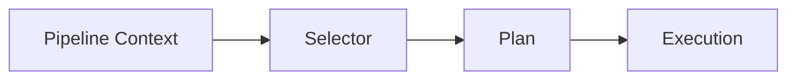

# 🗲 Spark Model

**Spark Model** is a lightweight framework designed to develop data transformations as reusable "models," inspired by tools like **dbt** but tailored for **Apache Spark**. It introduces a structured approach to data transformation, aligning with the principles of a **data mesh** to enhance semantic clarity, quality, and traceability.

---

## **Why Use Spark Model?**

Traditional Spark data transformations often follow a **sequential order** (e.g., `Deduplicate -> Pivot -> Rename`), but this approach lacks **semantic meaning** and the benefits of a **data mesh architecture**, such as:

- **Business Semantics**: Clear, domain-specific definitions for data.
- **Quality Tests**: Built-in validation to ensure data integrity.
- **Lineage and Standardization**: Traceability of transformations and consistent field naming.
- **DRY (Don’t Repeat Yourself)**: Avoid redundancy and align with the materialization of the data lake.

---

## **Core Components**

Spark Model consists of **three core components**:

### 1. **Model**
A model defines the transformation logic and includes:
- **Schema**: The structure of the output data.
- **Processor**: The transformation logic (e.g., deduplication, pivoting, renaming).
- **Materialization**: Where the data is written or read from (configurable per environment).
- **Layer**: Categorizes the model into one of the following layers:
  - `seed`: Static reference data.
  - `source`: Raw data sources.
  - `staging`: Initial transformations (e.g., cleaning, filtering).
  - `intermediate`: Business logic transformations.
  - `mart`: Aggregated, business-ready data.

### 2. **Registry**
The registry manages the metadata and configurations for models, including:
- Source definitions.
- Materialization settings (e.g., file, S3, database).

### 3. **Pipeline Context**
Configures the execution environment, such as:
- Time windows for incremental processing.
- Custom properties (e.g., environment-specific variables).

---

## **Getting Started**

### **1. Define a Source**
Sources represent raw data inputs. Configure them in the registry using YAML:

#### **Local Development Example**
```yaml
- name: SourceCotationProteoOleagineux
  materialized: file
  location: "input/histo_cotation_proteo-oleagineux.csv"
  file_format: csv
  read_options:
    header: true
    delimiter: ";"
``` 

**Production Example**
```yaml
    location: "s3a://<mybucket>/histo_cotation_proteo-oleagineux.csv"
```

### **2. Define a Model**

A **model** in Spark Model is composed of **three key components**, each implemented as a dedicated class:

- **Configuration**: Defines metadata such as the **layer** (e.g., `staging`, `intermediate`), **materialization** (e.g., `file`, `ephemeral`), and **unique keys** for the model.

- **Schema**: Specifies the **structure of the output data** (e.g., fields, data types) after the transformation is applied.

- **Processor**: Contains the **transformation logic**—the steps Spark executes to produce the desired output.

To implement a model, you must create **three corresponding classes**, as demonstrated in the example:

- **[Spark Model](example/src/main/java/ngz/markov/crops/models/staging/StgCotationProteoOleagineuxModel.java)**: Defines the model's configuration.
- **[Serializable Schema](example/src/main/java/ngz/markov/crops/models/staging/StgCotationProteoOleagineuxSchema.java)**: Specifies the schema of the transformed data.
- **[Model Processor](example/src/main/java/ngz/markov/crops/models/staging/StgCotationProteoOleagineuxProcessor.java)**: Implements the transformation logic.


### **3. Visualize Lineage**
Spark Model supports automated lineage visualization via Mermaid diagrams. Below is an example of how transformations flow from sources to marts:

```mermaid
flowchart LR;
    classDef bronzeClass fill:#CD7F32,stroke:#8B4513,stroke-width:2px,rx:10,ry:10,color:#000000;
    classDef silverClass fill:#C0C0C0,stroke:#707070,stroke-width:2px,rx:10,ry:10,color:#000000;
    classDef goldClass fill:#FFD700,stroke:#B8860B,stroke-width:2px,rx:10,ry:10,color:#000000;
    classDef sourceClass fill:#87CEEB,stroke:#4682B4,stroke-width:2px,rx:10,ry:10,color:#000000;
    classDef seedClass fill:#D8E9E6,stroke:#4682B4,stroke-width:2px,rx:10,ry:10,color:#000000;
    classDef edgeClass stroke:#333,stroke-width:2px;
    SourceMeteoFrancePaquet["SourceMeteoFrancePaquet"]:::sourceClass;
    click SourceMeteoFrancePaquet "#" "location: 'input/paquets/'<br> materialized: 'file'";
    SeedStandardizedVariable["SeedStandardizedVariable"]:::seedClass;
    click SeedStandardizedVariable "#" "location: 'input/referentiels/standardized_variable.csv'<br> materialized: 'file'";
    SeedStandardizedUnit["SeedStandardizedUnit"]:::seedClass;
    click SeedStandardizedUnit "#" "location: 'input/referentiels/standardized_unit.csv'<br> materialized: 'file'";
    StgMeteoFrancePaquetModel["StgMeteoFrancePaquetModel"]:::bronzeClass;
    click StgMeteoFrancePaquetModel "#" "location: 'null'<br> materialized: 'ephemeral'";
    SeedMeteoFranceStation["SeedMeteoFranceStation"]:::seedClass;
    click SeedMeteoFranceStation "#" "location: 'input/referentiels/meteofrance_stations.csv'<br> materialized: 'file'";
    IntStationGridMappingModel["IntStationGridMappingModel"]:::silverClass;
    click IntStationGridMappingModel "#" "location: 'null'<br> materialized: 'ephemeral'";
    SourceMeteoFranceObservation["SourceMeteoFranceObservation"]:::sourceClass;
    click SourceMeteoFranceObservation "#" "location: 'input/observations/'<br> materialized: 'file'";
    SeedMeteoFranceObservationVariable["SeedMeteoFranceObservationVariable"]:::seedClass;
    click SeedMeteoFranceObservationVariable "#" "location: 'input/referentiels/meteofrance_observation_variable.csv'<br> materialized: 'file'";
    StgMeteoFranceObservationModel["StgMeteoFranceObservationModel"]:::bronzeClass;
    click StgMeteoFranceObservationModel "#" "location: 'null'<br> materialized: 'ephemeral'";
    IntUnpivotObservationModel["IntUnpivotObservationModel"]:::silverClass;
    click IntUnpivotObservationModel "#" "location: 'null'<br> materialized: 'ephemeral'";
    IntStationForecastObservationModel["IntStationForecastObservationModel"]:::silverClass;
    click IntStationForecastObservationModel "#" "location: 'null'<br> materialized: 'ephemeral'";
    IntAggForecastErrorOverTimeModel["IntAggForecastErrorOverTimeModel"]:::silverClass;
    click IntAggForecastErrorOverTimeModel "#" "location: 'null'<br> materialized: 'ephemeral'";
    MartForecastErrorOverTimeModel["MartForecastErrorOverTimeModel"]:::goldClass;
    click MartForecastErrorOverTimeModel "#" "location: 'null'<br> materialized: 'ephemeral'";
    IntAggForecastErrorOverTimeModel --> MartForecastErrorOverTimeModel;
    IntStationForecastObservationModel --> IntAggForecastErrorOverTimeModel;
    StgMeteoFrancePaquetModel --> IntStationForecastObservationModel;
    SourceMeteoFrancePaquet --> StgMeteoFrancePaquetModel;
    SeedStandardizedVariable --> StgMeteoFrancePaquetModel;
    SeedStandardizedUnit --> StgMeteoFrancePaquetModel;
    IntStationGridMappingModel --> IntStationForecastObservationModel;
    SeedMeteoFranceStation --> IntStationGridMappingModel;
    StgMeteoFrancePaquetModel --> IntStationGridMappingModel;
    IntUnpivotObservationModel --> IntStationForecastObservationModel;
    StgMeteoFranceObservationModel --> IntUnpivotObservationModel;
    SourceMeteoFranceObservation --> StgMeteoFranceObservationModel;
    SeedMeteoFranceObservationVariable --> StgMeteoFranceObservationModel;
    SeedMeteoFranceStation --> StgMeteoFranceObservationModel;
    SeedStandardizedVariable --> StgMeteoFranceObservationModel;
    SeedMeteoFranceObservationVariable --> IntUnpivotObservationModel;
    SeedStandardizedVariable --> IntUnpivotObservationModel;
    SeedStandardizedUnit --> IntUnpivotObservationModel;

```


## **How It Works**
The execution flow in Spark Model follows this pipeline:

## Cite and Share

If you find this framework or its documentation useful, consider starring the repository to support its development! ✨