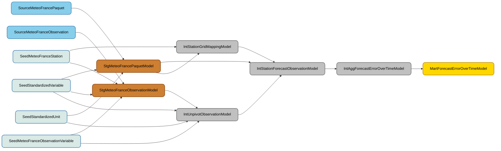

```mermaid
flowchart LR;
    classDef bronzeClass fill:#CD7F32,stroke:#8B4513,stroke-width:2px,rx:10,ry:10,color:#000000;
    classDef silverClass fill:#C0C0C0,stroke:#707070,stroke-width:2px,rx:10,ry:10,color:#000000;
    classDef goldClass fill:#FFD700,stroke:#B8860B,stroke-width:2px,rx:10,ry:10,color:#000000;
    classDef sourceClass fill:#87CEEB,stroke:#4682B4,stroke-width:2px,rx:10,ry:10,color:#000000;
    classDef seedClass fill:#D8E9E6,stroke:#4682B4,stroke-width:2px,rx:10,ry:10,color:#000000;
    classDef edgeClass stroke:#333,stroke-width:2px;
    SourceMeteoFrancePaquet["SourceMeteoFrancePaquet"]:::sourceClass;
    click SourceMeteoFrancePaquet "#" "location: 'input/paquets/'<br> materialized: 'file'";
    SeedStandardizedVariable["SeedStandardizedVariable"]:::seedClass;
    click SeedStandardizedVariable "#" "location: 'input/referentiels/standardized_variable.csv'<br> materialized: 'file'";
    SeedStandardizedUnit["SeedStandardizedUnit"]:::seedClass;
    click SeedStandardizedUnit "#" "location: 'input/referentiels/standardized_unit.csv'<br> materialized: 'file'";
    StgMeteoFrancePaquetModel["StgMeteoFrancePaquetModel"]:::bronzeClass;
    click StgMeteoFrancePaquetModel "#" "location: 'null'<br> materialized: 'ephemeral'";
    SeedMeteoFranceStation["SeedMeteoFranceStation"]:::seedClass;
    click SeedMeteoFranceStation "#" "location: 'input/referentiels/meteofrance_stations.csv'<br> materialized: 'file'";
    IntStationGridMappingModel["IntStationGridMappingModel"]:::silverClass;
    click IntStationGridMappingModel "#" "location: 'null'<br> materialized: 'ephemeral'";
    SourceMeteoFranceObservation["SourceMeteoFranceObservation"]:::sourceClass;
    click SourceMeteoFranceObservation "#" "location: 'input/observations/'<br> materialized: 'file'";
    SeedMeteoFranceObservationVariable["SeedMeteoFranceObservationVariable"]:::seedClass;
    click SeedMeteoFranceObservationVariable "#" "location: 'input/referentiels/meteofrance_observation_variable.csv'<br> materialized: 'file'";
    StgMeteoFranceObservationModel["StgMeteoFranceObservationModel"]:::bronzeClass;
    click StgMeteoFranceObservationModel "#" "location: 'null'<br> materialized: 'ephemeral'";
    IntUnpivotObservationModel["IntUnpivotObservationModel"]:::silverClass;
    click IntUnpivotObservationModel "#" "location: 'null'<br> materialized: 'ephemeral'";
    IntStationForecastObservationModel["IntStationForecastObservationModel"]:::silverClass;
    click IntStationForecastObservationModel "#" "location: 'null'<br> materialized: 'ephemeral'";
    IntAggForecastErrorOverTimeModel["IntAggForecastErrorOverTimeModel"]:::silverClass;
    click IntAggForecastErrorOverTimeModel "#" "location: 'null'<br> materialized: 'ephemeral'";
    MartForecastErrorOverTimeModel["MartForecastErrorOverTimeModel"]:::goldClass;
    click MartForecastErrorOverTimeModel "#" "location: 'null'<br> materialized: 'ephemeral'";
    IntAggForecastErrorOverTimeModel --> MartForecastErrorOverTimeModel;
    IntStationForecastObservationModel --> IntAggForecastErrorOverTimeModel;
    StgMeteoFrancePaquetModel --> IntStationForecastObservationModel;
    SourceMeteoFrancePaquet --> StgMeteoFrancePaquetModel;
    SeedStandardizedVariable --> StgMeteoFrancePaquetModel;
    SeedStandardizedUnit --> StgMeteoFrancePaquetModel;
    IntStationGridMappingModel --> IntStationForecastObservationModel;
    SeedMeteoFranceStation --> IntStationGridMappingModel;
    StgMeteoFrancePaquetModel --> IntStationGridMappingModel;
    IntUnpivotObservationModel --> IntStationForecastObservationModel;
    StgMeteoFranceObservationModel --> IntUnpivotObservationModel;
    SourceMeteoFranceObservation --> StgMeteoFranceObservationModel;
    SeedMeteoFranceObservationVariable --> StgMeteoFranceObservationModel;
    SeedMeteoFranceStation --> StgMeteoFranceObservationModel;
    SeedStandardizedVariable --> StgMeteoFranceObservationModel;
    SeedMeteoFranceObservationVariable --> IntUnpivotObservationModel;
    SeedStandardizedVariable --> IntUnpivotObservationModel;
    SeedStandardizedUnit --> IntUnpivotObservationModel;

```